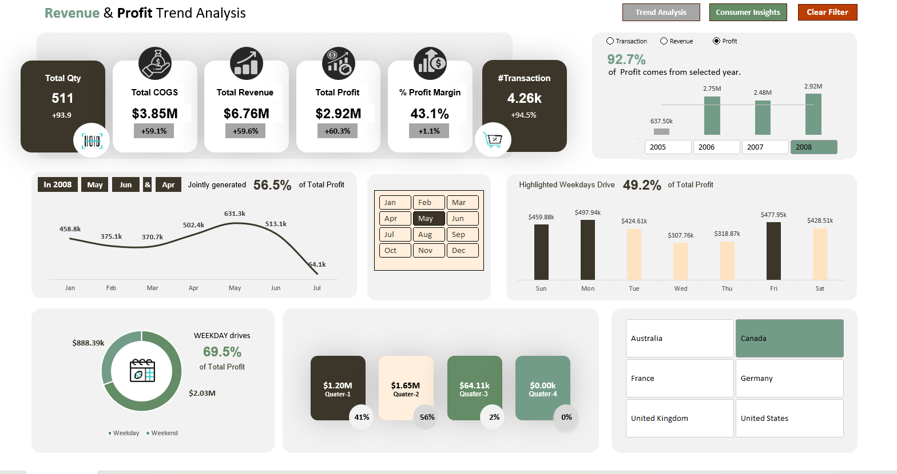
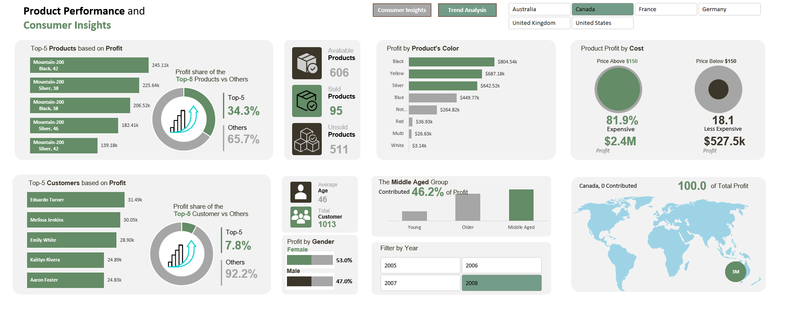
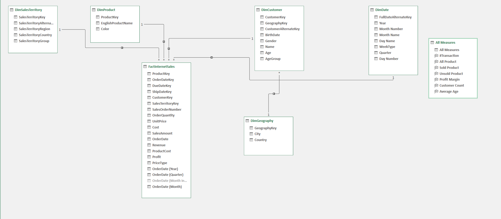

# AdventureWorks Excel Dashboard

## Project Overview

This project is an interactive Excel dashboard built using the Microsoft AdventureWorks dataset. The dashboard analyzes business performance across revenue, profit, product sales, customer behavior, geography, and time-based trends.

The main goal of this project was to practice Excel-based business intelligence, data modeling, Pivot Tables, Power Pivot, slicers, KPI cards, and dashboard design.

## Dashboards Included

### 1. Revenue & Profit Trend Analysis

This dashboard provides an executive-level overview of business performance.

Key insights included:

- Total Quantity
- Total COGS
- Total Revenue
- Total Profit
- Profit Margin
- Number of Transactions
- Year-wise profit trend
- Monthly profit trend
- Weekday vs weekend profit contribution
- Quarter-wise profit analysis
- Country filter and slicers

### 2. Product Performance and Consumer Insights

This dashboard focuses on product-level and customer-level business insights.

Key insights included:

- Top 5 products by profit
- Product profit share
- Available, sold, and unsold products
- Profit by product color
- Profit by product cost category
- Top 5 customers by profit
- Customer age group analysis
- Gender-based profit analysis
- Country-wise profit contribution
- Year and country filters

## Dataset

The project uses the Microsoft AdventureWorks dataset.

The Excel file contains multiple connected data tables, including:

- FactInternetSales
- DimProduct
- DimCustomer
- DimDate
- DimGeography
- DimSalesTerritory
- Measures table

These tables were connected using Excel Data Model and Power Pivot relationships.

## Data Model

The dashboard uses a relational data model where dimension tables are connected with the sales fact table.

Main relationships include:

- Product table connected with FactInternetSales
- Customer table connected with FactInternetSales
- Date table connected with FactInternetSales
- Geography table connected with Customer
- Sales Territory table connected with FactInternetSales

## Tools and Features Used

- Microsoft Excel
- Power Pivot
- Excel Data Model
- Pivot Tables
- Pivot Charts
- Slicers
- Timeline filters
- KPI cards
- Conditional formatting
- Custom formulas and measures
- Dashboard layout design
- Icons from Flaticon

## Key Measures Created

Some of the important measures used in this project include:

- Total Revenue
- Total Profit
- Total COGS
- Profit Margin
- Transaction Count
- Sold Products
- Unsold Products
- Customer Count
- Average Age

## Dashboard Preview

### Revenue & Profit Trend Analysis



### Product Performance and Consumer Insights



### Data Model



## Project Highlights

- Built a complete Excel BI dashboard from multiple connected datasets.
- Created a structured data model using Power Pivot.
- Designed two interactive dashboards for trend analysis and consumer insights.
- Used slicers for dynamic filtering by year, country, month, and metric.
- Applied business-focused KPIs to make the dashboard useful for decision-making.
- Used clean visual design with professional layout, icons, and color consistency.

## Business Insights

Some key insights from the dashboard include:

- Revenue and profit trends can be analyzed by year, month, quarter, and weekday.
- Product profitability varies significantly by product color and cost category.
- A small group of top products contributes a meaningful share of total profit.
- Customer demographics such as age group and gender help identify profitable customer segments.
- Geographic filters help compare country-level business performance.

## Files Included

```text
AdventureWorks_Dashboard.xlsx
README.md
images/revenue_profit_trend.png
images/product_customer_insights.png
images/data_model.png
```

## How to Use

- Download the Excel file from this repository.
- Open it in Microsoft Excel.
- Enable editing if required.
- Use slicers and filters to interact with the dashboard.
- Explore the Revenue & Profit Trend Analysis dashboard.
- Explore the Product Performance and Consumer Insights dashboard.

## Credits
- Dataset: Microsoft AdventureWorks dataset
- Icons: Flaticon
- Dashboard Design and Analysis: Created by Adnan Bin Abdul Khaleque

## About This Project

This project was created as part of my data analytics portfolio to demonstrate skills in Excel, data modeling, business intelligence, dashboard design, and analytical storytelling.
