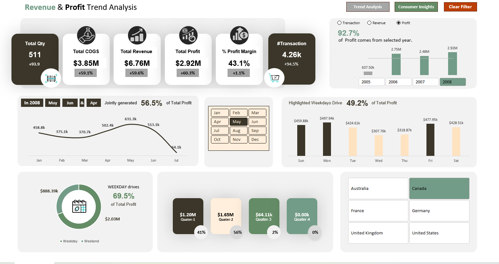
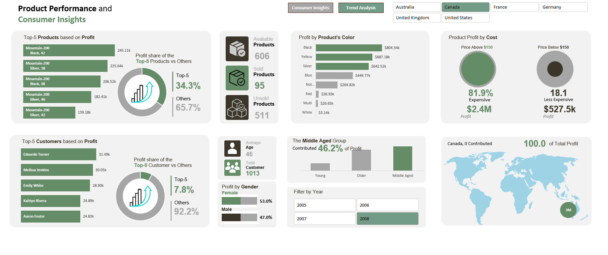

# 📊 Sales Performance Dashboard: Revenue, Profit & Customer Insights

An interactive two-page business intelligence dashboard that tracks **revenue and profit trends** and breaks down **product and customer performance** across countries and years. It is built to help decision-makers see what drives profit, when it peaks, and who generates it.


---

## 📌 Table of Contents
- [Project Overview](#-project-overview)
- [Business Questions](#-business-questions)
- [Dashboard Preview](#-dashboard-preview)
- [Key Insights](#-key-insights)
- [Features](#-features)
- [Tools & Skills](#-tools--skills)
- [Project Structure](#-project-structure)
- [How to Use](#-how-to-use)
- [Recommendations](#-recommendations)
- [Author](#-author)

---

## 🎯 Project Overview

This project turns raw sales transactions into two linked dashboards:

1. **Revenue & Profit Trend Analysis**: headline KPIs, yearly, monthly, quarterly and weekday profit patterns.
2. **Product Performance & Consumer Insights**: top products, top customers, colour and price-band profitability, and customer demographics.

Both pages share the same **country** and **year** slicers, so every chart updates together.

> **Note:** All figures below come from the dashboard screenshots with the **2008** year filter applied. Country slicers are available for Australia, Canada, France, Germany, United Kingdom and United States.

---

## ❓ Business Questions

- How much revenue and profit is the business generating, and at what margin?
- Which months, quarters and weekdays contribute the most profit?
- Which products, colours and price bands are the biggest profit drivers?
- Who are the top customers, and which demographic segments matter most?
- How concentrated is profit in a few products or customers?

---

## 🖼️ Dashboard Preview

### 1. Revenue & Profit Trend Analysis


### 2. Product Performance & Consumer Insights


---

## 💡 Key Insights

### 📈 Headline KPIs (2008)

| Metric | Value | Change shown on dashboard |
|---|---|---|
| Total Revenue | **$6.76M** | +59.6% |
| Total COGS | **$3.85M** | +59.1% |
| Total Profit | **$2.92M** | +60.3% |
| Profit Margin | **43.1%** | +1.1% |
| Total Quantity | **511** | +93.9 |
| Transactions | **4.26K** | +94.5% |

Profit grew slightly faster than revenue, so the margin improved while costs stayed under control.

### 🗓️ Trend Analysis

- **Yearly profit:** 2005: $637.5K → 2006: $2.75M → 2007: $2.48M → **2008: $2.92M (highest)**. 2008 is the best year even though its data runs only through July.
- **Peak months:** **April, May and June generated 56.5% of 2008 profit**. May is the peak at **$631.3K**.
- **Quarterly split:** Q1 **$1.20M (41%)**, Q2 **$1.65M (56%)**, Q3 **$64.1K (2%)**, Q4 **$0 (0%)**. Q3 and Q4 are low because the data is incomplete for the later months.
- **Weekday vs weekend:** Weekdays drive **69.5%** of profit (**$2.03M**) against **$888.4K** on weekends.
- **Best days:** **Monday ($497.9K)**, **Friday ($478.0K)** and **Sunday ($459.9K)** together deliver **49.2%** of profit. **Wednesday ($307.8K)** is the weakest day.

### 🚴 Product Insights

- **606 products** are available, but only **95 sold (15.7%)**. **511 are unsold (84.3%)**.
- The **Top-5 products** (all **Mountain-200** variants) contribute **34.3%** of profit. The best is **Mountain-200 Black, 42 at $245.1K**.
- **By colour:** Black **$804.5K**, Yellow **$687.2K** and Silver **$642.5K** are the leaders, together about **73%** of profit. White, Multi and Red add very little.
- **By price:** Products priced **above $150** generate **$2.4M (81.9%)** of profit. Cheaper products add **$527.5K (18.1%)**.

### 👥 Customer Insights

- **1,013 customers** with an **average age of 46**.
- **Middle-aged customers** contribute the most profit at **46.2%**.
- **Gender split:** Female **53.0%**, Male **47.0%**.
- **Top-5 customers** (Eduardo Turner, Melissa Jenkins, Emily White, Kaitlyn Rivera, Aaron Foster) contribute **7.8%** of profit, so there is **low customer concentration risk**.
- The top customer, **Eduardo Turner**, generated **$31.5K** in profit.

---

## ✨ Features

- 🔀 **Two-page navigation** with *Trend Analysis* and *Consumer Insights* buttons
- 🌍 **Country slicers** for 6 markets
- 📅 **Year and month slicers** for 2005–2008 and Jan–Dec
- 🔘 **Metric toggle** to switch the yearly chart between Transaction, Revenue and Profit
- 🧹 **Clear Filter** button to reset all selections
- 🗺️ **Map view** of profit by country
- 🎨 Consistent colour theme with KPI cards and donut charts

---

## 🛠️ Tools & Skills

| Area | Details |
|---|---|
| Tool | Microsoft Excel (PivotTables, Pivot Charts, Slicers) |
| Data prep | Power Query, data cleaning, calculated columns |
| Analysis | KPI design, trend analysis, Pareto / Top-N, segmentation |
| Visualisation | Dashboard layout, interactive filtering, storytelling |

> Update this table if you used Power BI, Tableau, SQL or other tools.

---

## 📁 Project Structure

```
├── README.md
├── images/
│   ├── revenue_profit_trend.png
│   └── product_customer_insights.png
├── data/
│   └── sales_data.xlsx            # raw / cleaned dataset
└── dashboard/
    └── Sales_Dashboard.xlsx       # final interactive dashboard
```

---

## ▶️ How to Use

1. Clone or download this repository.
2. Open `dashboard/Sales_Dashboard.xlsx` in Microsoft Excel (2016 or later).
3. Enable content or macros if prompted.
4. Use the **country**, **year** and **month** slicers to explore the data.
5. Click **Clear Filter** to reset, or use the top buttons to switch pages.

---

## ✅ Recommendations

1. **Plan for seasonality:** Run promotions and secure stock ahead of the April–June peak.
2. **Focus on high-value products:** Prioritise Mountain-200 variants and products priced above $150.
3. **Review the long tail:** 84% of products did not sell, so consider rationalising the catalogue.
4. **Lift slow days:** Run Wednesday and Thursday offers to balance weekday sales.
5. **Retain middle-aged customers:** Build loyalty campaigns for the segment that earns the most.
6. **Complete the data:** Load full Q3 and Q4 2008 data for a fair year-on-year comparison.

---

## 👤 Author

**Adnan Bin Abdul Khaleque**

